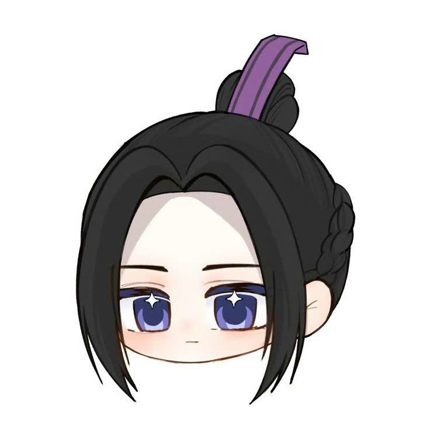
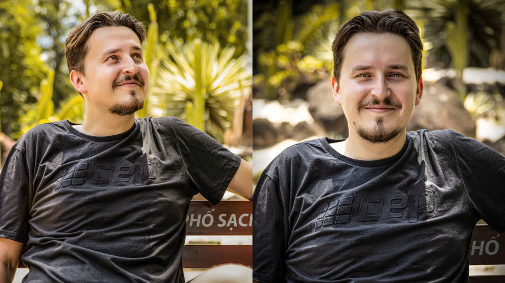

  

  
  
  

#  Xin chào! Mình tên là Đặng Thúy Ngọc 
## 👩‍🎨 Thông tin về mình

Mình là một sinh viên ngành Công nghệ đa phương tiện với niềm đam mê mãnh liệt dành cho nghệ thuật thị giác, sáng tạo kỹ thuật số và trải nghiệm người dùng. Mình tin rằng thiết kế không chỉ là cái đẹp, mà còn là cách truyền tải thông điệp, cảm xúc và giá trị đến cộng đồng.

Hiện tại, mình đang theo học tại Học Viện Công Nghệ Bưu Chính Viễn Thông (Post and Telecommunications Institute of Technology), nơi mình được tiếp cận với các nguyên lý thiết kế, công cụ sáng tạo hiện đại và các dự án thực tế. Mình luôn tìm kiếm cơ hội để học hỏi, cộng tác và phát triển bản thân trong môi trường sáng tạo.

## 🎓 Trình độ học vấn
- Từng theo học tại trường THPT Trần Hưng Đạo tỉnh Tiền Giang
- Từng trong đội tuyển học sinh giỏi văn của trường
- Đạt giải olympic toán online cấp thành phố
- Đạt giải vẽ môi trường xanh cấp trường
- Đạt giải nhì cuộc thi Thủ Khoa Huân cấp trường
- GPA đại học qua các kì: 3.24 xếp loại giỏi
- Có bằng tin học văn phòng xếp loại xuất sắc

## 🧰 Kỹ năng chuyên môn

### 💻 Tech Stack:
           

### 🎨 Thiết kế & Sáng tạo
- Thiết kế nhận diện thương hiệu (logo, bộ nhận diện)
- Thiết kế giao diện người dùng (UI/UX)
- Minh họa kỹ thuật số & vẽ tay
- Thiết kế ấn phẩm truyền thông (poster, brochure, banner)
  
### 📷 Nhiếp ảnh & Video
- Chụp ảnh nghệ thuật & chỉnh sửa hậu kỳ
- Viết kịch bản cho MV, chuyển thể truyện ngắn thành phim,...
- Dựng video cơ bản với Premiere Pro / After Effects

## 📁 Dự án Cá Nhân

<h3><b> Đồ Án Thiết Kế Bìa Sách </b></h3>

<h3><b>Photograph</b></h3>

Xem thêm sản phẩm photograhp tại đây: https://www.instagram.com/heraliin?igsh=MTd4bWdzaGVqMzB0cg==

## 📁 Dự án Nhóm

<h3><b>MV SAY YOU DO</b></h3>

<h3><b>Vị trí của mình trong nhóm: Leader, Scrips Writer, Director, Editor, Camera Crew, Behind The Scence </b></h3>

<h3><b>THIẾT KẾ VÀ PHÁT TRIỂN GAME LỆ CHI VIÊN</b></h3>
<h3><b>Vị trí của mình trong nhóm: Prototypes Designer, Scrips Writer </b></h3>

## 🎯 Mục tiêu tương lai

- Không ngừng học hỏi và nâng cao kỹ năng, tư duy thiết kế để trở thành một designer chuyên nghiệp.
- Tham gia các dự án mã nguồn mở và cộng đồng công nghệ để chia sẻ kiến thức và kinh nghiệm.
- Mong muốn làm việc trong môi trường hòa đồng, nơi có thể học hỏi và đóng góp vào các sản phẩm cho đất nước.
- Tham gia các hoạt động thiện nguyện giúp đỡ người già và trẻ nhỏ khó khăn
- Mang những con chữ, ấm no đến cho các em vùng sâu vùng xa
- Xây dựng truyền thông, gửi thông điệp của các cựu chiến binh, mẹ Việt Nam Anh hùng lan tỏa khắp mọi miền Tổ Quốc
  
# 📊 GitHub Stats:
 
 

## 🏆 GitHub Trophies

---

<!-- Proudly created with GPRM ( https://gprm.itsvg.in ) -->

  
## 📫 Kết nối với mình tại

-  [Thúy Ngọc](https://web.facebook.com/ngocdangeri)
-  [dathng186@gmail.com](mailto:dathng186@gmail.com)  
-  [@heraliin](https://www.instagram.com/heraliin?igsh=MTd4bWdzaGVqMzB0cg==)  

Cảm ơn bạn đã ghé thăm hồ sơ của mình! Nếu bạn yêu thích thiết kế, nghệ thuật hoặc muốn hợp tác, đừng ngần ngại kết nối nhé 💬✨
